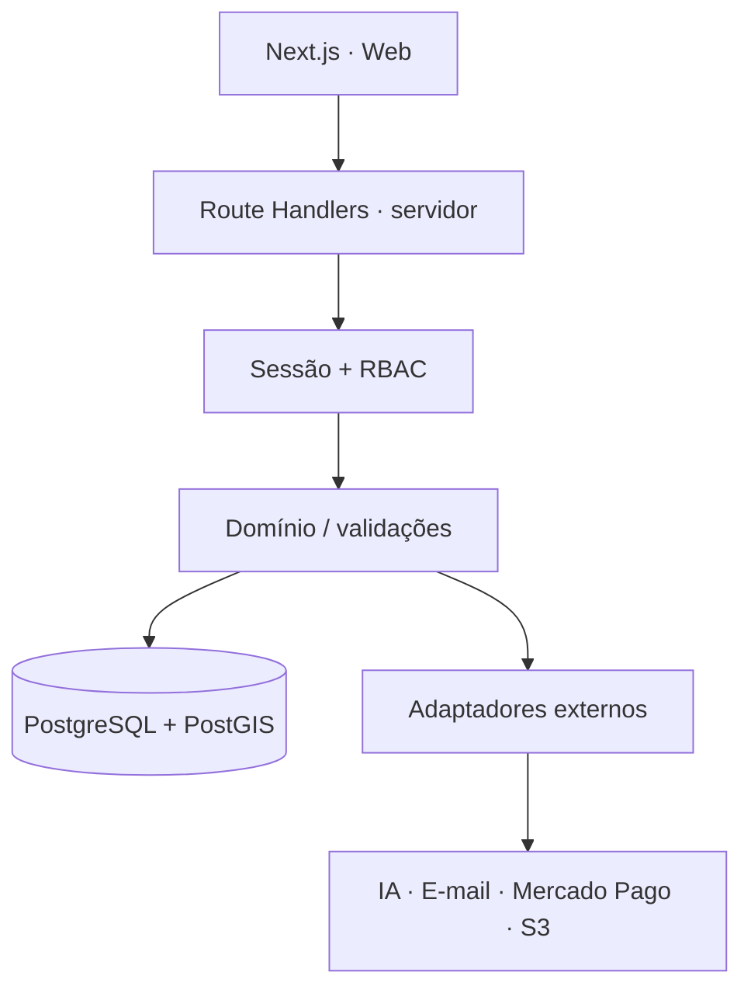

# Arquitetura — RAIZ Digital

## Direção

O MVP usa um **monólito modular em Next.js + TypeScript**. A decisão continua sendo operar com baixo custo e pouca complexidade, sem sacrificar isolamento de dados ou rastreabilidade.

## Banco e tenancy

- Driver selecionado: `pg`, sem ORM obrigatório.
- Toda operação de negócio usa `withTenant()`.
- A transação executa `set_config('app.tenant_id', ..., true)` e `set_config('app.user_id', ..., true)` antes de acessar dados operacionais.
- RLS permanece como segunda barreira, além da autorização da aplicação.
- Funções `SECURITY DEFINER` são usadas apenas para descobrir memberships no momento em que ainda não existe tenant de sessão.
- PostGIS é a fonte oficial para limites e pontos; talhão é armazenado como `MultiPolygon,4326`.
- Área de talhão criada pela API é calculada pelo próprio PostGIS em hectares.

## Autenticação

A 0.4 usa autenticação self-hosted simples:

1. usuário localizado por e-mail;
2. senha verificada com Argon2;
3. membership ativa resolvida no banco;
4. se houver múltiplas empresas, o login exige seleção de tenant;
5. servidor gera token aleatório de 32 bytes;
6. somente SHA-256 do token é persistido em `user_sessions`;
7. token bruto fica em cookie `HttpOnly`, `SameSite=Lax`, `Secure` em produção;
8. sessão expirada/revogada não acessa o tenant.

2FA, recuperação de senha, rotação avançada e convites ainda são pendências obrigatórias antes de produção.

## Persistência implementada

- clientes;
- propriedades;
- talhões GeoJSON/PostGIS;
- safras;
- análises;
- sessões;
- importações laboratoriais normalizadas;
- auditoria de criações/importações.

## Entrada laboratorial

O CSV é validado uma primeira vez para prévia e **revalidado no servidor no momento do commit**. A aplicação não confia no preview enviado pelo navegador. Importações com bloqueios podem ser registradas como `INCONSISTENT`, mantendo as linhas que provocaram o conflito para futura conferência.

## Separação demo × real

`DATA_MODE=demo` existe somente para revisão visual. `DATA_MODE=database` usa dados reais e telas ainda não conectadas exibem estado vazio/pendente em vez de valores inventados.

## Motor agronômico

A arquitetura original permanece:

- cálculos e classificações determinísticas em rule sets versionados;
- IA somente para narrativa e assistência;
- memória de cálculo e fontes rastreáveis;
- revisão profissional antes de publicação;
- nenhum parecer é mostrado no modo real enquanto não houver interpretação registrada.

## Próximos blocos

1. interface de cadastro de propriedade/talhão com desenho/importação GeoJSON;
2. ordem de coleta + GPS/GeoJSON/KML/GPX;
3. adaptadores XLSX/PDF de laboratório;
4. primeiro rule set homologado com casos conhecidos;
5. revisão, aprovação e versionamento de interpretação;
6. relatório PDF e storage S3;
7. 2FA, recuperação de senha e convite de usuários;
8. homologação do Mercado Pago e jobs assíncronos.
