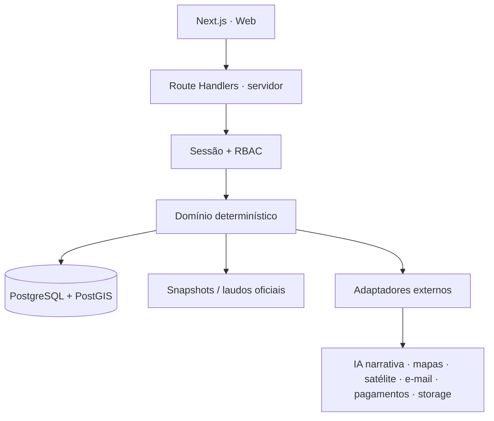

# Arquitetura — RAIZ Digital

Estado de referência: **2026-09-25**. Para SHAs, gates e releases correntes, consulte `docs/CURRENT_STATE.md`.

## Direção

O RAIZ Digital usa um **monólito modular em Next.js + TypeScript**, com PostgreSQL/PostGIS como fonte oficial. A arquitetura prioriza baixo custo, isolamento multiempresa, rastreabilidade e reversibilidade.

## Banco e tenancy

- Driver: `pg`, sem ORM obrigatório.
- Operações de negócio usam contexto de tenant/usuário.
- RLS continua como barreira de isolamento adicional à autorização da aplicação.
- Runtime deve usar papel restrito sem `BYPASSRLS`; papel administrativo é reservado a migrations/administração.
- PostGIS é a fonte para geometrias e cálculos espaciais.
- O repositório possui 42 migrations versionadas.
- Antes de qualquer migration em produção, confirmar ledger, backup/PITR e autorização explícita.

## Autenticação e autorização

- sessão opaca persistida;
- token bruto apenas no cookie `HttpOnly`;
- SHA-256 do token no banco;
- Argon2 para senha;
- 2FA/TOTP e códigos de backup;
- recuperação de senha;
- memberships multiempresa;
- RBAC server-side;
- trilha de auditoria.

Esses itens não devem ser reimplementados como “pendência do MVP”; já fazem parte da base atual.

## Operação agronômica

Persistência real para:
- clientes;
- propriedades;
- talhões;
- safras/culturas;
- laboratórios;
- ordens/pontos de coleta;
- análises/importações;
- resultados laboratoriais normalizados;
- interpretações;
- prescrições;
- recomendações de insumo;
- snapshots comerciais;
- relatórios oficiais;
- NDVI/raster e metadados associados;
- auditoria.

## Entrada laboratorial

CSV e XLSX passam pelo mesmo núcleo de validação. O servidor revalida os dados antes do commit. Proveniência, método, unidade e vínculo com análise/amostra devem permanecer rastreáveis.

PDF/OCR não deve ser tratado como disponível sem implementação e conferência humana adequadas.

## Motor agronômico

- regras e cálculos oficiais são determinísticos;
- rule sets/evidências são versionados;
- IA pode auxiliar narrativa e interface, mas não inventa ou substitui a decisão agronômica;
- ausência de dado opcional reduz profundidade, não bloqueia conclusões independentes já suportadas;
- quando uma conclusão específica não é suportada, falhar fechado naquele ponto, não no relatório inteiro.

## Prescrição e revisão

A arquitetura possui fluxo executável de interpretação/prescrição com revisão e aprovação. Recomendações oficiais são ligadas à geração aprovada e o laudo congela o estado publicado.

A republicação é versionada e imutável. Mudanças relevantes de evidência ou de plano comercial podem gerar nova revisão oficial.

## Plano comercial

A camada comercial é separada da necessidade agronômica:

1. motor agronômico define necessidade técnica;
2. usuário escolhe explicitamente cenário/produto comercial;
3. motor comercial converte garantias/PRNT/preço em quantidade/custo;
4. publish valida que o cenário pertence à análise e à prescrição corrente;
5. o laudo oficial congela o cenário;
6. preço/custo só aparecem quando efetivamente congelados.

Nunca escolher marca/produto automaticamente nessa camada.

## Mapas e satélite

- mapas de talhão, fertilidade e pontos;
- satélite no fluxo de mapas;
- NDVI versionado;
- custódia de raster;
- fallback de providers onde aplicável;
- mobile deve evitar overflow e cargas desnecessárias.

A fonte/algoritmo do raster precisa continuar rastreável por snapshot.

## Relatórios oficiais

O relatório oficial usa snapshot imutável e deve:
- preservar a decisão aprovada;
- mostrar resumo técnico;
- mostrar resumo simples para o produtor;
- calcular total da área apenas quando a unidade permite cálculo exato;
- distinguir nutriente equivalente de massa de produto;
- incluir produto/preço/custo somente quando o plano comercial foi explicitamente congelado.

## Demo × real

`DATA_MODE=demo` serve apenas para experiência visual demonstrativa.

`DATA_MODE=database` nunca pode preencher lacunas com números, diagnósticos ou recomendações fictícias.

## Fluxo de entrega

- feature branch → `develop`;
- CI + Preview + QA;
- autorização explícita para integração relevante;
- PR `develop → main`;
- Production Promotion Guard + CI;
- autorização explícita;
- merge em `main`;
- validação pós-release.

O histórico de commits entre `main` e `develop` pode divergir pelos merge commits de release; avaliar sempre o diff real de arquivos.

## Limites

Não assumir que:
- uma URL de Preview é a URL canônica de produção;
- status Vercel sozinho comprova smoke HTTP autenticado;
- um dado ausente pode ser inferido;
- uma branch de banco pode ser alterada sem autorização;
- uma migration antiga precisa ser reexecutada apenas porque aparece em documentação histórica.
